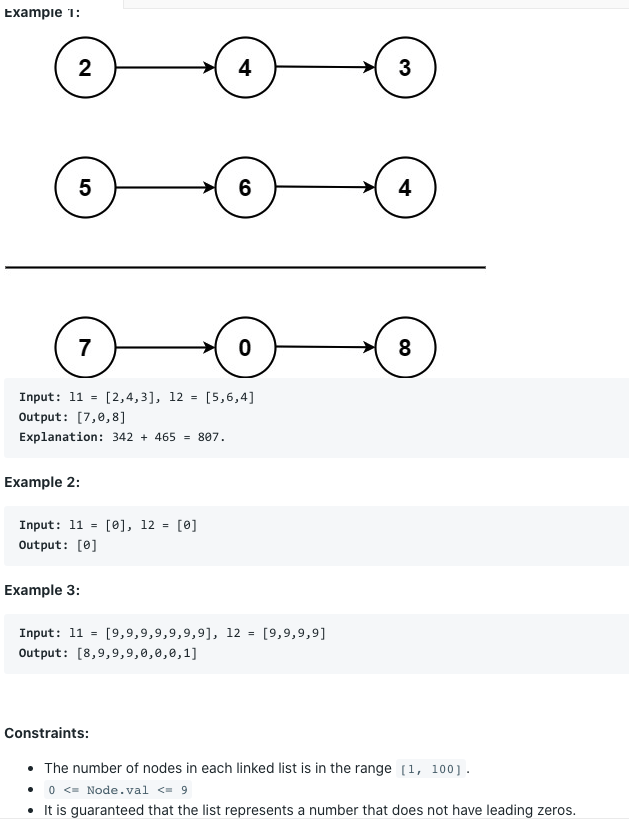

# 82. Remove Duplicates from Sorted List II

## Tips

* The tail of the modified linked list must be **GROUNDED**

## Problem Description

Given the head of a sorted linked list, delete all nodes that have duplicate numbers, leaving only distinct numbers from the original list. Return the linked list sorted as well.



## Solution

```
/**
 * Definition for singly-linked list.
 * public class ListNode {
 *     int val;
 *     ListNode next;
 *     ListNode() {}
 *     ListNode(int val) { this.val = val; }
 *     ListNode(int val, ListNode next) { this.val = val; this.next = next; }
 * }
 */
class Solution {
    public ListNode deleteDuplicates(ListNode head) {
        // corner case
        if (head == null || head.next == null) {
            return head;
        }
        // linearly scan the list
        ListNode dummy = new ListNode(0);
        ListNode curr = dummy;
        ListNode pointer = head;
        while (pointer != null) {
            boolean hasDup = false;
            if (pointer != null && pointer.next != null && pointer.val == pointer.next.val) {
                int currVal = pointer.val;
                hasDup = true;
                pointer = pointer.next;
                while (pointer != null && currVal == pointer.val) {
                    pointer = pointer.next;
                }
            }
            if (!hasDup) {
                curr.next = pointer;
                curr = curr.next;
                pointer = pointer.next;
            }
        }
        curr.next = null;
        // return
        return dummy.next;
    }
}

/*

Clarification & Assumption
Sorted in ascending order
If there is no node, return null

Result
Linearly scan the list
For each node in the list, decide whether or not keep this node
Case 1: no duplicate
    append the node
Case 2: has duplicate
    skip all duplicates

Time: O(n)
Space: O(1)

*/
```

